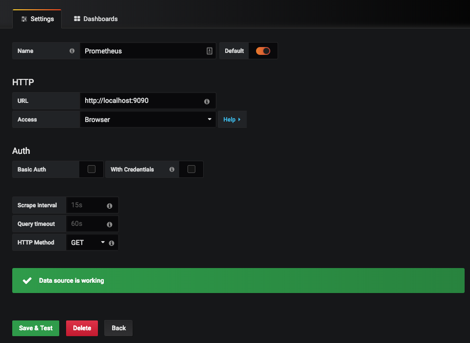
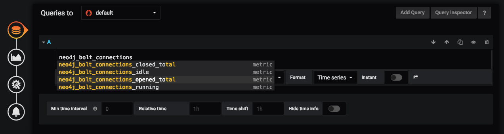

# Neo4j Causal Cluster

This [Docker Compose](https://docs.docker.com/compose/) example is provided to help developers test their applications against a neo4j cluster. This cluster uses the offical [Neo4j enterprise image (3.5.3)](https://neo4j.com/release-notes/neo4j-3-5-3/) (please review the [license information](https://neo4j.com/licensing/) before use).

The project also uses Prometheus and Grafana - Prometheus scrapes metrics from the Neo4j servers for display in Grafana

## Starting the cluster

This project use a [Docker Compose](https://docs.docker.com/compose/) file (v3.x) that requires docker engine: 1.13.0+, 17.04.0+.

Start your environment with:

```bash
    docker-compose up
```

Access the cluster nodes at:

* [node1](http://localhost:7474/browser/)
* [node2](http://localhost:7475/browser/)
* [node3](http://localhost:7476/browser/)

Use `neo4j/opencredo` as user/password, but remember to change the password after logging in using:

```none
    :server change-password
```

This project uses a Docker Compose file (v3.x) that requires docker engine: 1.13.0+, 17.04.0+.

Start your environment with:

```cypher
    CALL dbms.cluster.overview
```

## Monitoring

Prometheus runs [locally](http://localhost:9090/graph); you will need to configure a datasource in [graphana](http://localhost:3000/) to create cluster dashboards.

The default username and password for Grafana is `admin/admin`

Grafana will require a new datasource:



And then we are ready to create new dashboards


